# M2W

**Speak with your eyes.**

  <a href="https://youtu.be/kM2ivaYuCfE">
    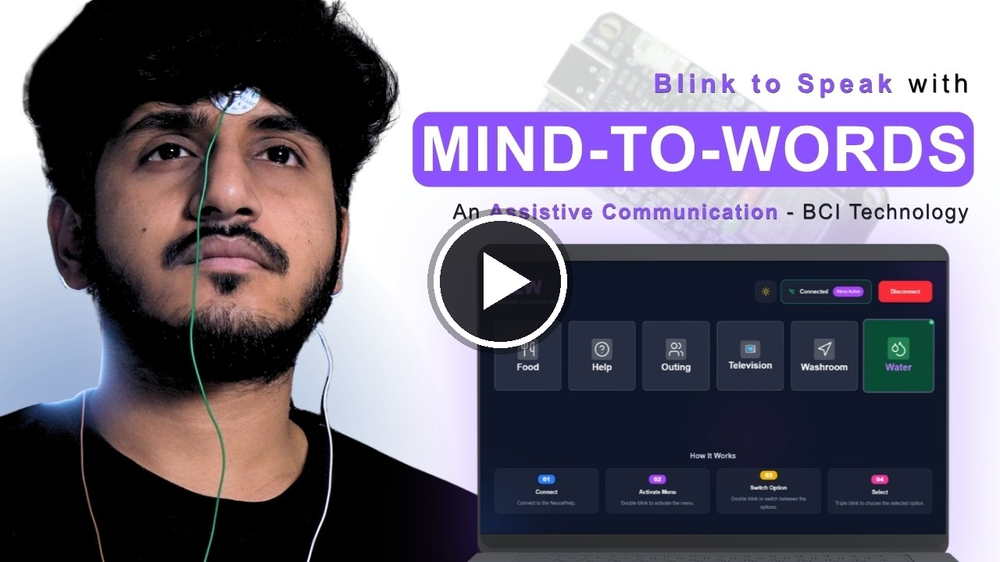
  </a>

## Overview

M2W (Mind to Words) is a free, browser-based assistive communication app for people who cannot speak or move, such as ALS patients. It connects to the Neuro PlayGround (NPG) Lite over Bluetooth and reads a single blink-detection channel from the forehead. A menu of everyday needs (Food, Help, Outing, Television, Washroom and Water) is navigated entirely with eye blinks, and the app speaks the selected need out loud.

## Features

| Feature | Description |
| --- | --- |
| **Wireless** | Connects to the NPG Lite over Bluetooth Low Energy (BLE). |
| **Blink-only control** | Double blink to open and move through the menu, triple blink to select. No hands, mouse or keyboard needed. |
| **6 Need Categories** | Food, Help, Outing, Television, Washroom and Water, each with its own spoken audio. |
| **Spoken Feedback** | Plays a sound for the selected need, so the person nearby hears it announced. |
| **Light / Dark Theme** | Switch between light and dark mode for comfortable viewing. |
| **Zero Install** | Runs entirely in the browser as a static web app. Nothing to download or set up. |

## Requirements

- A Chromium-based browser with Web Bluetooth support: **Chrome, Edge, Brave**, etc. On iOS, use a BLE-enabled browser such as **Bluefy**.
- NPG Lite ([Explorer, Ninja or Beast pack](https://docs.upsidedownlabs.tech/hardware/bioamp/neuro-play-ground-lite/index.html)), only 1 channel is needed.
- BioAmp snap cables and gel electrodes (2 for the signal, plus 1 reference)
- NuPrep skin preparation gel (optional) and alcohol swabs
- USB Type-C cable

## Setup

### 1. Flash the firmware

1. Turn on your NPG Lite using the power switch and make sure the battery is connected correctly.
2. Connect the NPG Lite to your computer with the USB Type-C cable.
3. Open [NPG-Lite-Flasher-Web](https://upsidedownlabs.github.io/NPG-Lite-Flasher-Web/) in a Chromium-based browser.

   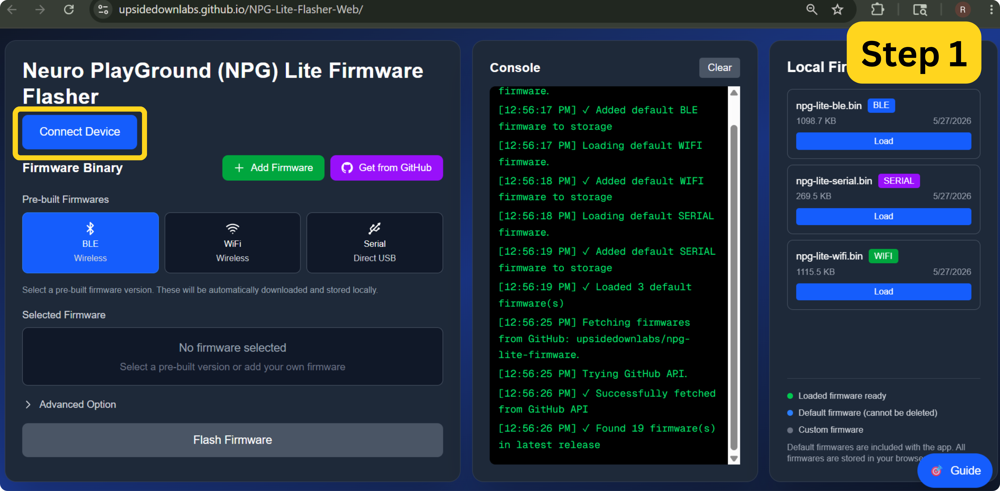

4. Click **Connect Device** and select the USB device named **USB JTAG**.

   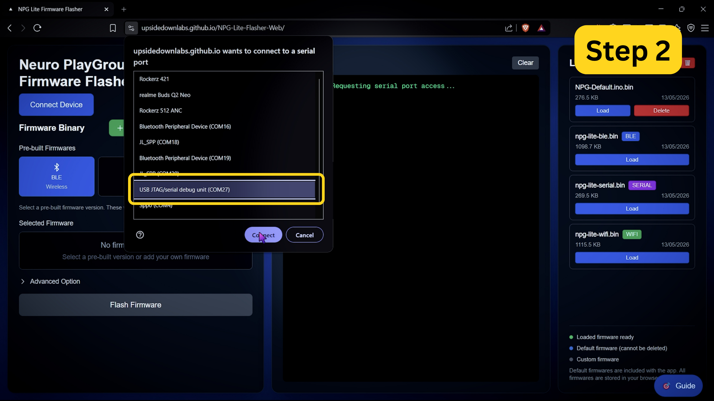

5. Once connected, click **Get from GitHub** to browse the available firmware.

   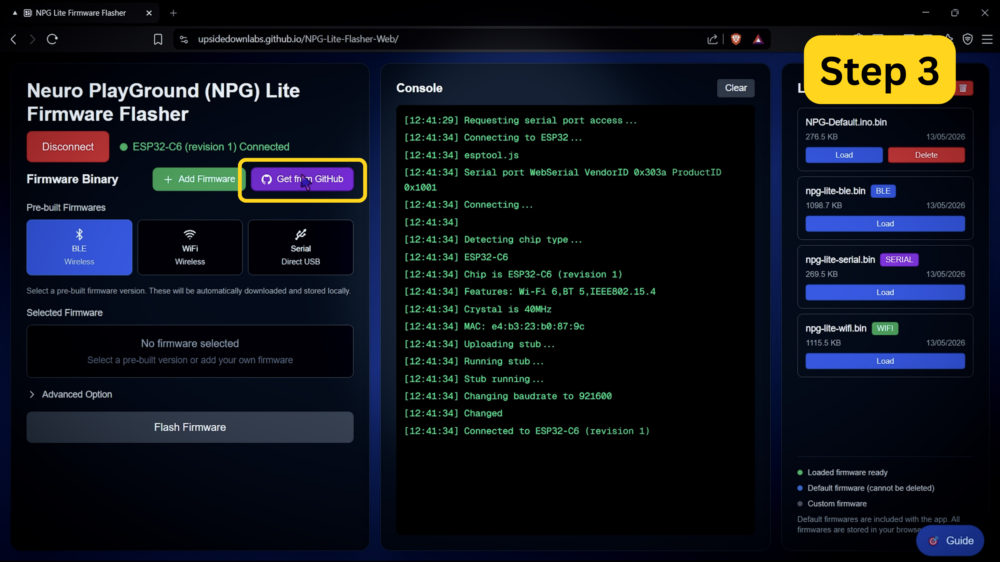

6. Select **BCI-Blink-BLE.ino.bin** from the list. This is the blink-detection firmware M2W needs.

   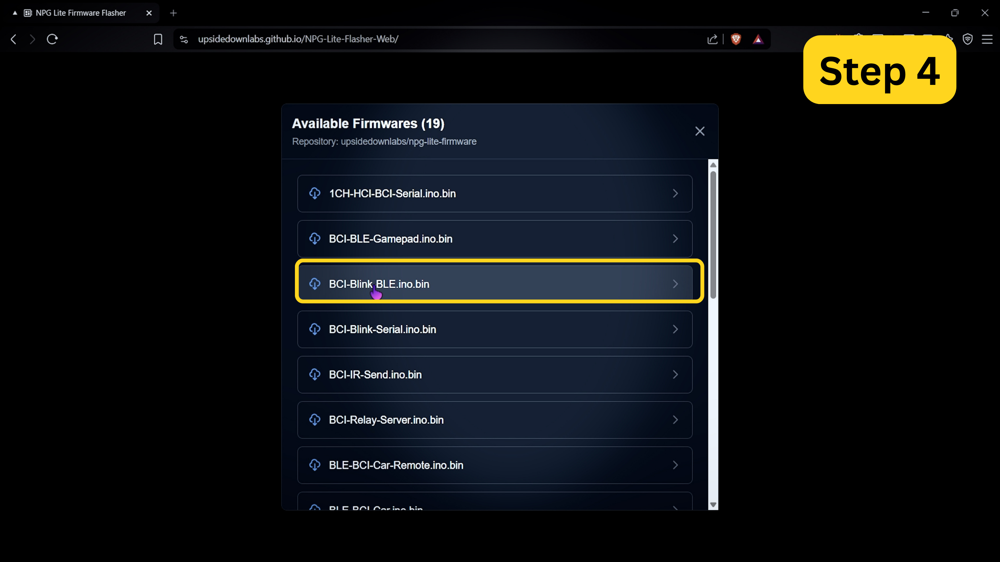

7. Click **Flash Firmware** and wait for it to finish uploading.

   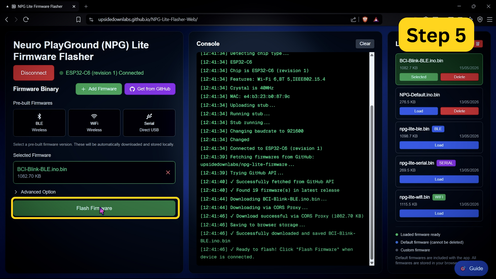

8. Once you see **Flash completed successfully!**, disconnect the USB cable.

   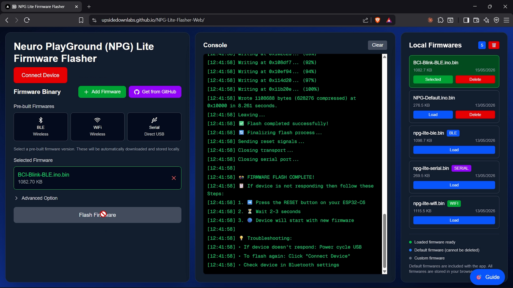

### 2. Prepare your skin

Good skin preparation gives a much cleaner signal.

1. Clean the areas where the electrodes will go with an alcohol swab or wet wipe.
2. For an even better signal, you can first apply a small amount of NuPrep skin preparation gel and then clean the skin.
3. Let the skin dry before placing the electrodes.

### 3. Place the electrodes

Place the positive electrode (**IN+**, red) on the centre of your forehead, the negative electrode (**IN-**, black) behind one ear, and the reference electrode (**REF**, yellow) behind the other ear.

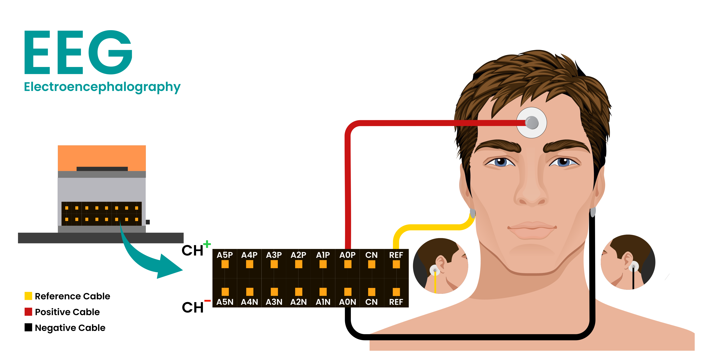

### 4. Connect the cables

Connect the cables to Channel 1 on the NPG Lite: red to **A0P**, black to **A0N**, and yellow to **REF**.

## How to use it

Open [M2W](https://upsidedownlabs.github.io/M2W/) in your browser.

### Step 1: Make sure Bluetooth is on

Turn on your NPG Lite and make sure Bluetooth is enabled on your computer or phone.

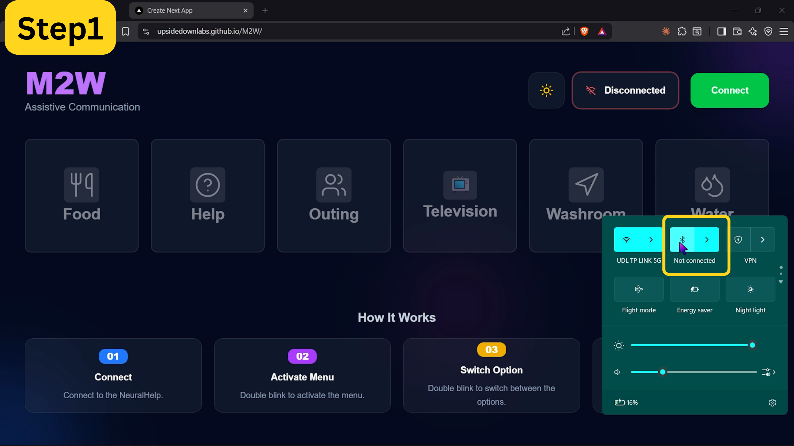

### Step 2: Connect

Click **Connect** at the top right of the app.

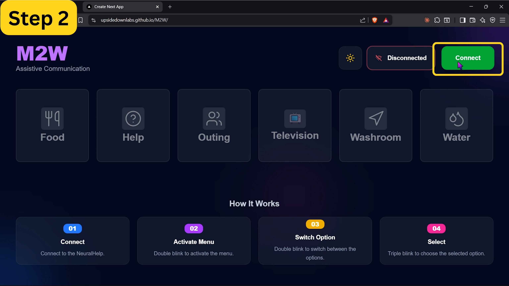

### Step 3: Pair your NPG Lite

Select **ESP32C6_EEG** from the browser's Bluetooth pairing popup and click **Pair**.

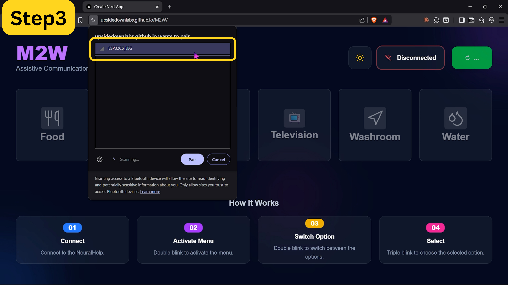

### Step 4: Start using the menu

Once connected, the status changes to **Connected** and you're ready to go.

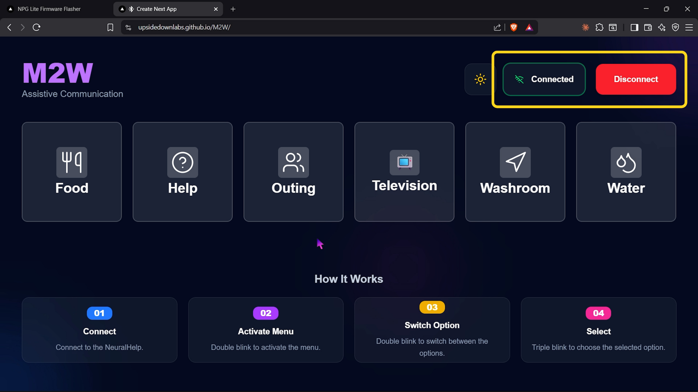

## Using the menu

The menu is controlled entirely with blinks, detected from the forehead electrode:

| Step | Gesture | What happens |
| --- | --- | --- |
| **Connect** | N/A | Connect to the NPG Lite as shown above. |
| **Activate Menu** | Double blink | Opens the menu and highlights the first option (Food). |
| **Switch Option** | Double blink | Moves the highlight to the next option, cycling through Food, Help, Outing, Television, Washroom and Water. |
| **Select** | Triple blink | Chooses the highlighted option. The app plays that need's spoken audio out loud and highlights it green until you move to another option or the menu closes. |

The menu also shows a **Menu Active** badge next to the connection status while it's open. If the device disconnects, the menu closes automatically.

> [!TIP]
> While connected, you can also click a tile directly with a mouse or touch to hear its audio, which is useful for testing electrode placement and volume before relying on blinks alone.

## Technologies Used

M2W is built with **Next.js**, **React** and **TypeScript**, styled with **Tailwind CSS**, and talks to the NPG Lite using the browser's **Web Bluetooth API**. It's a static site with no backend, deployed on GitHub Pages.
